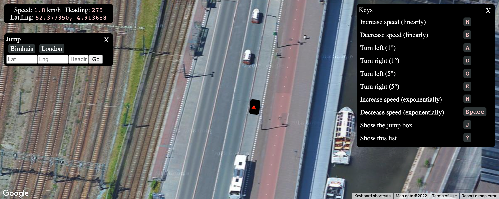

# Over Map Driving Simulator 

This is a driving simulator based on [a Google Maps
sample](https://developers.google.com/maps/documentation/javascript/examples/aerial-simple).



## Setup

```sh
npm i
npm start  # development
npm run build  # production
```

The application is currently using the `.env` file to embed the API key in the
HTML document. This is a temporary key and is not valid for production usage. It
can be replaced by following these instructions to
[get an api key](https://developers.google.com/maps/documentation/javascript/get-api-key).
